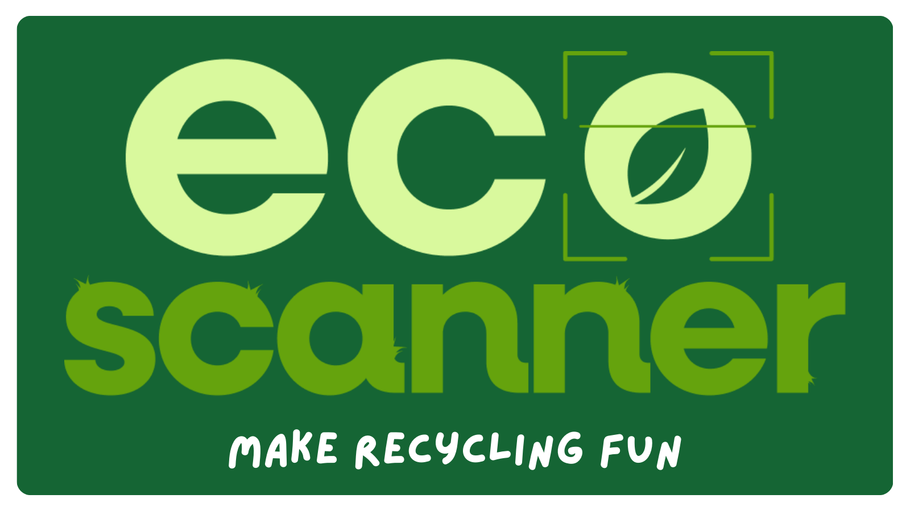
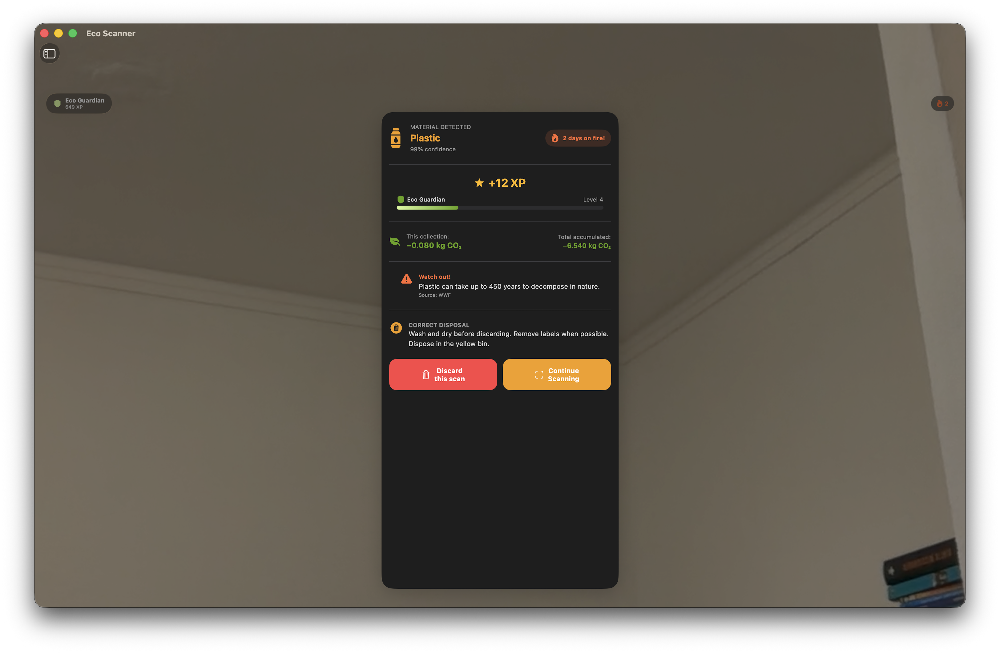
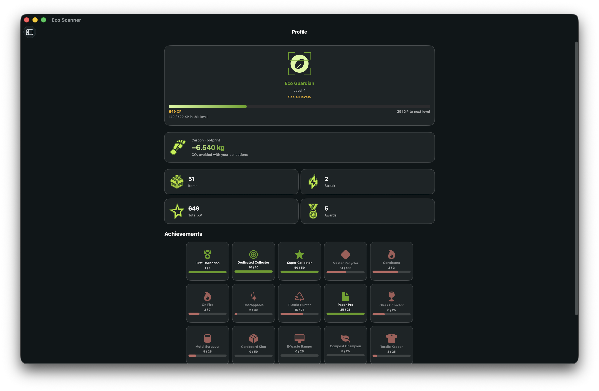
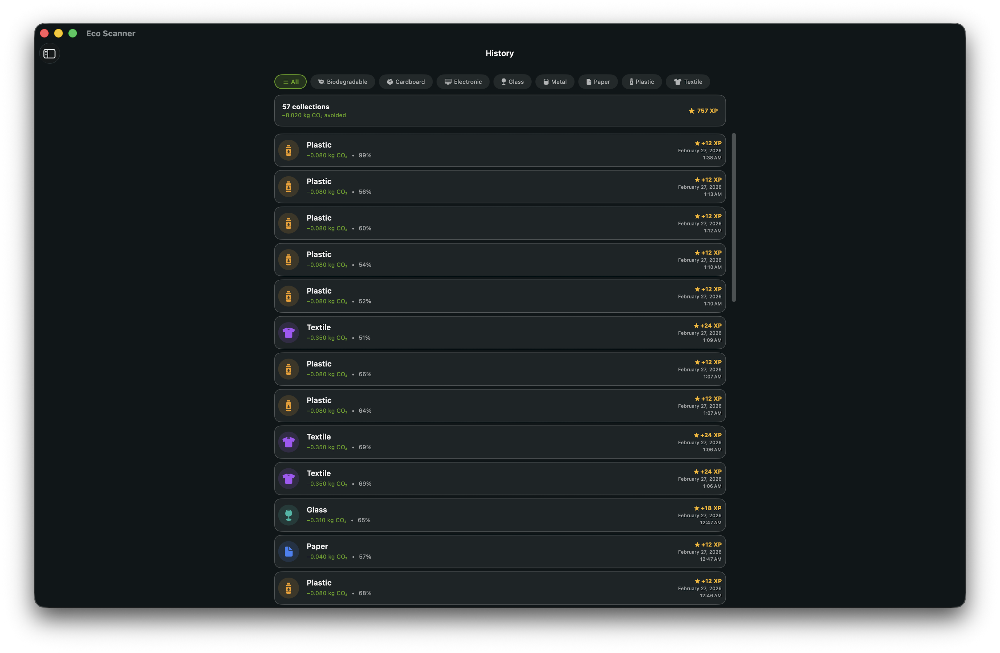

# EcoScanner
### Apple Swift Student Challenge Project

EcoScanner uses the device camera and CoreML to identify recyclable materials in real time. The app aims to gamify the recycling experience, teaching proper disposal and tracking user impact through XP, levels, streaks, and achievements.

**Used Technologies**: SwiftUI, SwiftData, CoreML

|  |  |
| --- | --- |
|  |  |

## Installation and Usage

### Requirements

Supported Devices: 
  - iPhone or iPad
  - A device with a camera

Supported Platforms: 
  - iOS or iPadOS
    
### Installation

Requirements: Swift Playgrounds or Xcode

- Clone the repository.
- Open the `EcoScanner.swiftpm` file with Swift Playgrounds or Xcode.
- Select your device or a simulator as the Run Destination (a physical device is required for camera features).
- Run the project.

### Usage

- Allow camera permissions when prompted.
- Point the camera at a recyclable item.
- Follow the on-screen instructions to scan, collect, and view information about the scanned material.

## Credits

The machine learning models used in EcoScanner were built based on the following datasets:

- [Garbage Classification v2](https://www.kaggle.com/datasets/sumn2u/garbage-classification-v2) by sumn2u
- [Garbage Classification](https://www.kaggle.com/datasets/asdasdasasdas/garbage-classification) by asdasdasasdas
- [Garbage Classification](https://www.kaggle.com/datasets/mostafaabla/garbage-classification) by mostafaabla
- [Plastic Paper Garbage Bag (Synthetic Images)](https://www.kaggle.com/datasets/vencerlanz09/plastic-paper-garbage-bag-synthetic-images) by vencerlanz09
- [Trash Type Image Dataset](https://www.kaggle.com/datasets/farzadnekouei/trash-type-image-dataset) by farzadnekouei
- [Garbage Classification](https://www.kaggle.com/datasets/hassnainzaidi/garbage-classification) by hassnainzaidi
- [Tipe Webscraping](https://www.kaggle.com/datasets/manonstr/tipe-webscraping) by manonstr

## License

This project is licensed under the [MIT License](LICENSE.md).